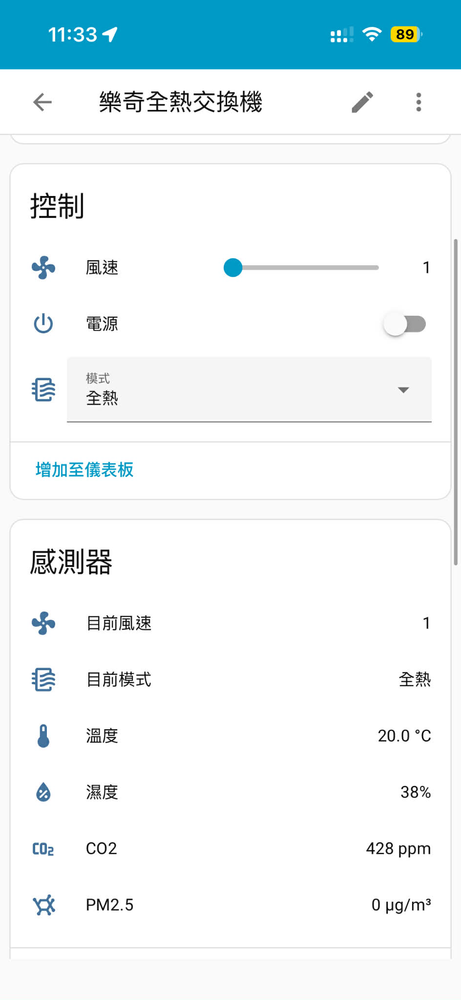

# Lifegear 樂奇全熱交換機 Home Assistant 整合

Home Assistant 自訂整合，支援樂奇電器全熱交換機透過智慧果 M8連接。

## 功能

- ✅ 即時讀取 CO2、PM2.5、溫度、濕度
- ✅ 遠端控制電源開關
- ✅ 切換模式（自動/淨化/全熱）
- ✅ 調整風速（1-4 檔）
- ✅ 自動重試機制確保指令送達
- ✅ 繁體中文介面

## 支援設備

- 樂奇智慧果 M8

## 安裝

### HACS 安裝（推薦）

1. 開啟 HACS
2. 點選右上角三個點 → **自訂儲存庫**
3. 輸入 `3uperduck/lifegear_hrv`，類別選擇 `整合`
4. 點選 **安裝**
5. 重啟 Home Assistant

### 手動安裝

1. 下載此儲存庫
2. 將 `custom_components/lifegear_hrv` 資料夾複製到你的 Home Assistant `config/custom_components/` 目錄
3. 重啟 Home Assistant

## 設定

1. 前往 **設定** → **裝置與服務**
2. 點選 **新增整合**
3. 搜尋 **Lifegear** 或 **樂奇**
4. 輸入你的帳號資訊：
   - 使用者 ID (u_id)
   - 認證碼 (AuthCode)

### 如何取得帳號資訊？

需要透過封包擷取取得 App 的 API 參數：

1. 在電腦上開啟 **行動熱點**
2. 將智慧果 M8 連接到電腦熱點
3. 將手機也連接到電腦熱點
4. 使用 **Wireshark** 監聽熱點網路介面
5. 在手機上開啟樂奇智慧果 App 並操作設備
6. 在 Wireshark 中過濾 `http` 封包
7. 找到發送到 `m8.daguan-tech.com.tw` 的請求
8. 從請求內容中取得 `u_id` 和 `AuthCode`

## 實體說明

此整合會建立以下實體：

### 感測器
| 實體 | 說明 |
|------|------|
| CO2 | 二氧化碳濃度 (ppm) |
| PM2.5 | 細懸浮微粒濃度 (µg/m³) |
| 溫度 | 室內溫度 (°C) |
| 濕度 | 室內相對濕度 (%) |
| 目前風速 | 當前風速檔位 |
| 目前模式 | 當前運轉模式 |

### 控制
| 實體 | 說明 |
|------|------|
| 電源 | 開關機控制 |
| 模式 | 自動/淨化/全熱 |
| 風速 | 1-4 檔風速調整 |

## 截圖

## 問題回報

如果遇到問題，請在 [GitHub Issues](https://github.com/3uperduck/lifegear_hrv/issues) 回報。

## 授權

MIT License

## 致謝

- 感謝 [Anthropic Claude](https://www.anthropic.com/) 協助開發此整合
